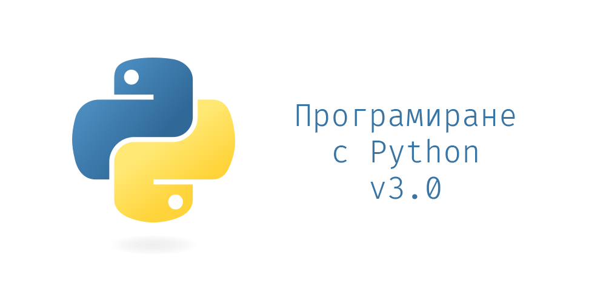

# Курс "Програмиране с Python" 2024

Github repository към курса "Програмиране с Python" във ФМИ

email: pythoncoursefmi@gmail.com

## Провеждане

- понеделник: 18:00-20:00 @ зала 325
- четвъртък: 19:00-21:00 @ зала 101

### Лекции

Всички лекции са събрани под формата на Jupyter notebook интерактивни записки.

JupyterBook "книжка" с всички теми има тук: https://fmipython.github.io/PythonCourse2024

| Тема номер | Тема                                                                                                                | Дата                   | Лектор                                                                                                                                                                  |
| ---------- | ------------------------------------------------------------------------------------------------------------------- | ---------------------- | ----------------------------------------------------------------------------------------------------------------------------------------------------------------------- |
| 0          | [Въведение към курса](./00%20-%20Course%20intro/)                                                                   | 03.10.2024             | [Любо](https://github.com/lyubolp) & [Алекс И.](https://github.com/yalishanda42) & [Кари](https://github.com/karinaghristova) & [Алекс К.](https://github.com/Bladwark) |
| 1          | [Въведение в Python: какво е Python, настройка на средата, как да пуснем лекциите](./01%20-%20Intro%20to%20Python/) | 03.10.2024             | [Любо](https://github.com/lyubolp) & [Алекс И.](https://github.com/yalishanda42) & [Кари](https://github.com/karinaghristova) & [Алекс К.](https://github.com/Bladwark) |
| 2          | [Променливи, разклонения, цикли](./02%20-%20Variables,%20types,%20control%20flow/)                                  | 07.10.2024, 10.10.2024 | [Алекс](https://github.com/yalishanda42) & [Кари](https://github.com/karinaghristova)                                                                                   |
| 3          | [Обектно-ориентирано програмиране в Python](./03%20-%20OOP/)                                                        | 14.10.2024, 17.10.2024 | [Алекс](https://github.com/yalishanda42)                                                                                                                                |
| 4          | [Функционално програмиране в Python](./04%20-%20Functional%20Programming/)                                          | 24.10.2024, 28.10.2024 | [Любо](https://github.com/lyubolp)                                                                                                                                      |
| 5          | [Представяне на структури от данни и алгоритми над тях](./05%20-%20Data%20Structures%20and%20Oddities/)             | 04.11.2024, 07.11.2024 | [Любо](https://github.com/lyubolp)                                                                                                                                      |
| 6          | [Типова система на езика](./06%20-%20Typing%20Hints/)                                                               | 14.11.2024             | [Алекс](https://github.com/yalishanda42)                                                                                                                                |
| 7          | [Грешки и изключения](./07%20-%20Exceptions%20Handling/)                                                            | 18.11.2024             | [Алекс](https://github.com/yalishanda42)                                                                                                                                |
| 8          | [Работа с файлове](./08%20-%20Files/)                                                                               | 21.11.2024             | [Любо](https://github.com/lyubolp)                                                                                                                                      |
| 9          | [Многонишково програмиране](./09%20-%20Multithreading/)                                                             | 02.12.2024             | [Любо](https://github.com/lyubolp)                                                                                                                                      |
| 10         | [Работа със заявки](./10%20-%20requests/)                                                                           | 05.12.2024             | [Алекс](https://github.com/yalishanda42)                                                                                                                                |
| 11         | [Работа с Git](./11%20-%20Git/)                                                                                     | 05.12.2024             | [Алекс](https://github.com/yalishanda42)                                                                                                                                |
| 12         | [Модули и пакети](./12%20-%20Modules/)                                                                              | 09.12.2024             | [Алекс](https://github.com/yalishanda42)                                                                                                                                |
| 13         | [Принципи на качествения код на Python](./13%20-%20Clean%20code/)                                                   | 12.12.2024             | [Любо](https://github.com/lyubolp)                                                                                                                                      |
| 14         | [Тестване в Python](./14%20-%20Testing/)                                                                            | 19.12.2025             | [Алекс](https://github.com/yalishanda42)                                                                                                                                |
| 15         | [Уеб програмиране. Flask](./15%20-%20Web%20programming/)                                                            | 06.01.2025             | [Любо](https://github.com/lyubolp)                                                                                                                                      |
| 16         | [Използване на C код в Python](./16%20-%20Using%20C%20code%20in%20Python/)                                          | 13.01.2025             | [Любо](https://github.com/lyubolp)                                                                                                                                      |
| 17         | [Външни библиотеки (numpy, pandas, matplotlib)](./17%20-%20numpy,%20pandas,%20matplotlib/)                          | 16.01.2025             | [Любо](https://github.com/lyubolp)                                                                                                                                      |

### Упражнения

Вместо лекции, на някои дати ще се провеждат специални упражнения, на които ще се решават задачи за текущ контрол. График:

| №   | Дата       | Теми          | Точки | Линк                                                                                       |
| --- | ---------- | ------------- | ----- | ------------------------------------------------------------------------------------------ |
| 1   | 21.10.2024 | 2, 3          | 5т    | [Задачи](https://github.com/fmipython/PythonCourse2024/blob/master/labs/lab01/lab01.ipynb) |
| 2   | 31.10.2024 | 4             | 5т    | [Задачи](https://github.com/fmipython/PythonCourse2024/blob/master/labs/lab02/lab02.ipynb) |
| 3   | 11.11.2024 | 5             | 3т    | [Задачи](https://github.com/fmipython/PythonCourse2024/blob/master/labs/lab03/lab03.md)    |
| 4   | 28.11.2024 | 6, 7, 8       | 3т    | [Задачи](https://github.com/fmipython/PythonCourse2024/blob/master/labs/lab04/lab04.ipynb) |
| 5   | 16.12.2024 | 9, 10, 11, 12 | 5т    | [Задачи](https://github.com/fmipython/PythonCourse2024/blob/master/labs/lab05/lab05.md)    |
| 6   | 09.01.2024 | 13, 14        | 3т    | [Задачи](https://youtu.be/ARJ8cAGm6JE?feature=shared&t=63)                                 |

### Тестове

На тези дати ще провеждаме тестовете в курса. Тестовете ще са няколко въпроса, в рамките на няколко минути. Провеждането им ще е в Moodle.
| № | Дата | Теми |
|---|------------|------|
|1 | 14.10.2024 | 1, 2 |
|2 | 24.10.2024 | 3 |
|3 | 04.11.2024 | 4 |
|4 | 14.11.2024 | 5 |
|5 | 18.11.2024 | 6 |
|6 | 21.11.2024 | 7 |
|7 | 02.12.2024 | 8 |
|8 | 05.12.2024 | 9 |
|9 | 19.12.2024 | 12 |
|10 | 13.01.2025 | 14 |

## Оценяване

Крайната оценка (мин 2, макс 6) се изчислява по следната формула:

$$ Оценка = \frac{Упражнения + Тестове + Бонус + Проект}{10} $$

Нужно е да отбележим, че **нито един от четирите компонента не е задължителен** за успешното взимане на курса.

Максимални точки:

- Упражнения: 25т.
- Тестове: 10т.
- Бонус: 5т.
- Проект: 40т.

# Как да пиша и подкарам Python кода си?

Вж. [тук](./01%20-%20Intro%20to%20Python/install-n-setup.md)

# Как да си пуснем лекциите/материалите?

Вж. [тук](./01%20-%20Intro%20to%20Python/notebooks.md)

# Оценяване на проектите?

Вж. [тук](./projects.md)

# Примерни проекти?

Вж. [тук](./example_projects.md)

# Принос

Ако откриете бъг, правописна грешка или генерално нещо грешно, може да отворите pull request чрез съответен branch съдържащ номера на лекцията. При промяна на някоя от тетрадките, задължително изпълнете тетрадката отначало преди качването в Git (за да са подредени номерцата на output-ите).
